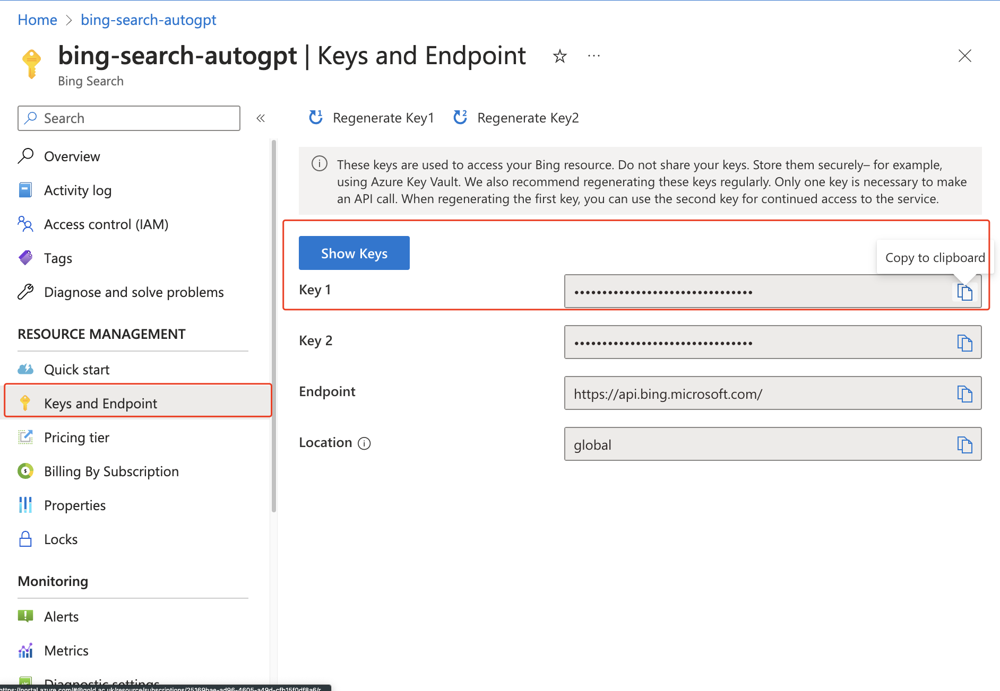

# Auto-GPT 必应百度搜索插件：扩展你的 Auto-GPT 搜索选项

语言: [English](https://github.com/ForestLinSen/Auto-GPT-Plugins/blob/master/src/autogpt_plugins/bing_baidu_search/README.md) | [中文](https://github.com/ForestLinSen/Auto-GPT-Plugins/blob/master/src/autogpt_plugins/bing_baidu_search/README.zh.md)

Auto-GPT 必应百度搜索插件是基础项目 Auto-GPT 的一个实用插件。为了扩展搜索选项，此搜索插件将必应和百度搜索引擎集成到 Auto-GPT 中，补充了原有的 Google 搜索和 DuckDuckGo 搜索。

## 主要功能：
- 必应搜索：使用必应搜索引擎进行搜索查询。
- 百度搜索：使用百度搜索引擎进行搜索查询。

## 工作原理：
如果设置了 Azure API (`AZURE_API_KEY `) 密钥，搜索引擎将默认为必应。要使用百度搜索，请将环境变量 `SEARCH_ENGINE` 设置为 "baidu" 并提供 `BAIDU_COOKIE`。

## 安装:
1. 以 ZIP 文件格式下载 Auto-GPT 必应百度搜索插件存储库。
2. 将 ZIP 文件复制到 Auto-GPT 项目的 "plugins" 文件夹中。

### Azure API 密钥和必应搜索配置:
1. 访问 [Bing Web Search API](https://www.microsoft.com/en-us/bing/apis/bing-web-search-api)。
2. 登录您的 Microsoft Azure 帐户，如果没有帐户，请创建一个新帐户。
3. 设置帐户后，转到 "Keys and Endpoint" 部分。
4. 从那里复制密钥并将其添加到项目目录中的 .env 文件中。
5. 将环境变量命名为 `AZURE_API_KEY`。



`.env` 文件示例：
```
AZURE_API_KEY=your_azure_api_key
```

请将 `your_azure_api_key` 替换为从 Microsoft Azure 获取的实际 API 密钥。

### 获取百度 Cookie:
1. 打开 Chrome 浏览器并在百度上搜索随便某个内容。
2. 打开开发者工具（按 F12 或右键单击并选择 "审查元素"）。
3. 转到 "网络" 标签。
4. 在网络请求列表中找到第一个名称文件。
5. 在右侧找到 "Cookie" 标头并复制所有内容。


在 `.env` 文件中设置 `BAIDU_COOKIE`：
```
BAIDU_COOKIE=your-baidu-cookie
```

请将 `your-baidu-cookie` 替换为从 Chrome 开发者工具获取的实际 Cookie 内容。


